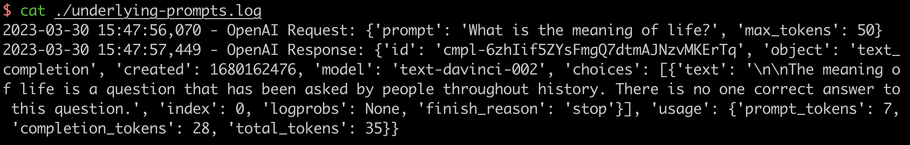

# Underlyging Prompts

The utility to inspect underlying prompts which are actually used for LLM applications.

It is helpful for prompt engineering and records all the OpenAI requests and responses without extra cost. If you want to understand the underlying generated prompts from LLM applications like [langchain](https://github.com/hwchase17/langchain) or [openmldb-chatgpt-plugin](https://github.com/tobegit3hub/openmldb-chatgpt-plugin), you can use [underlyging-prompts](https://github.com/tobegit3hub/underlyging-prompts) easily.

## Install

```
pip install underlying-prompts
```

## Usage

Start the server.

```
underlying-prompts
```

Set the environment for clients.

```
export OPENAI_API_BASE=http://127.0.0.1:8888/v1
```

Run the demo OpenAI client.

```
./demo/openai_demo.py
```

Check out the server log or prompts history.

```
cat ./underlying-prompts.log
```



## Reset

Reset the environment variable if you do not want to record prompts.

```
unset OPENAI_API_BASE
```

## How It Works

It is the simple HTTP server to redirect requests from [openai library](https://github.com/openai/openai-python). The user's requests will be fully forwards to OpenAI API server and it helps to records the underlying request data and response data.

Here is the sample code of [server.py](./underlying_prompts/server.py).

```
headers = {
    "Content-Type": request.headers["Content-Type"],
    "Authorization": request.headers["Authorization"]
}
json_data = request.get_json()
logger.info(f"OpenAI Request: {json_data}")

url = f"https://api.openai.com/{path}"
response = requests.post(
    url,
    headers=headers,
    json=json_data
)
logger.info(f"OpenAI Response: {response.json()}")
```
